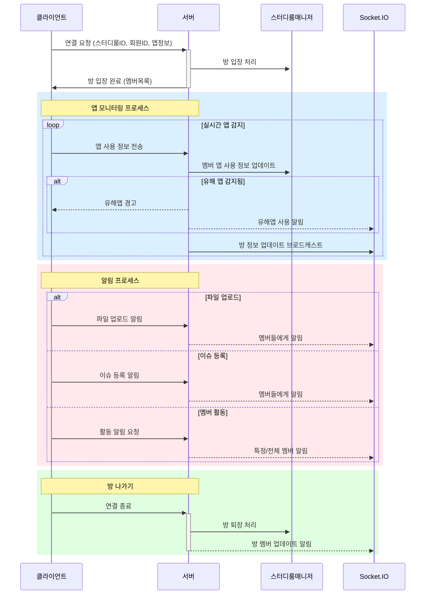

# Linkode_Media

## 시퀀스 다이어 그램  

```mermaid
sequenceDiagram
    participant C as 클라이언트
    participant S as 서버
    participant RM as 스터디룸매니저
    participant IO as Socket.IO

    %% 초기 연결 및 방 입장
    C->>+S: 연결 요청 (스터디룸ID, 회원ID, 앱정보)
    S->>+RM: 방 입장 처리
    S->>-C: 방 입장 완료 (멤버목록)

    rect rgba(135, 206, 250, 0.3)
        Note over C,S: 앱 모니터링 프로세스
        loop 실시간 앱 감지
            C->>S: 앱 사용 정보 전송
            S->>RM: 멤버 앱 사용 정보 업데이트
            
            alt 유해 앱 감지됨
                S-->>C: 유해앱 경고
                S-->>IO: 유해앱 사용 알림
            end
            
            S->>IO: 방 정보 업데이트 브로드캐스트
        end
    end

    rect rgba(255, 182, 193, 0.3)
        Note over C,S: 알림 프로세스
        alt 파일 업로드
            C->>S: 파일 업로드 알림
            S-->>IO: 멤버들에게 알림
        else 이슈 등록
            C->>S: 이슈 등록 알림
            S-->>IO: 멤버들에게 알림
        else 멤버 활동
            C->>S: 활동 알림 요청
            S-->>IO: 특정/전체 멤버 알림
        end
    end

    rect rgba(152, 251, 152, 0.3)
        Note over C,S: 방 나가기
        C->>+S: 연결 종료
        S->>RM: 방 퇴장 처리
        S-->>-IO: 방 멤버 업데이트 알림
    end
```
